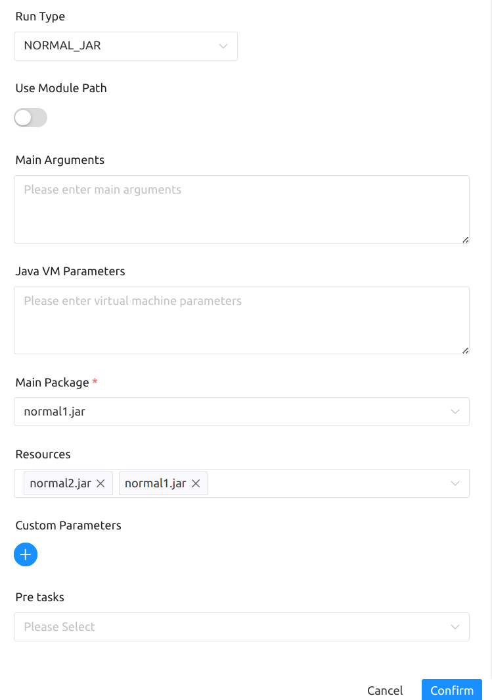

# Overview

This node is used to execute Java tasks and supports using both fat and normal JAR packages as program entry points.

# Create Tasks

- Click on `Project Management` -> `Project Name` -> `Workflow Definition`, click on the “Create workflow” button, go to the DAG edit page:

- Drag the toolbar's Java task node to the palette.

# Task Parameters

[//]: # (TODO: use the commented anchor below once our website template supports this syntax)
[//]: # (- Please refer to [DolphinScheduler Task Parameters Appendix]&#40;appendix.md#default-task-parameters&#41; `Default Task Parameters` section for default parameters.)

- Please refer to [DolphinScheduler Task Parameters Appendix](appendix.md) `Default Task Parameters` section for default parameters.

|   **Parameter**    |                                                                **Description**                                                                |
|--------------------|-----------------------------------------------------------------------------------------------------------------------------------------------|
| Module Path        | pick Java 9 + 's modularity feature, put all resources into-module-path, and require that the JDK version in your worker supports modularity. |
| Main Parameter     | Java program main method entry parameter.                                                                                                     |
| Java VM Parameters | JVM startup parameters.                                                                                                                       |
| Main Package       | Select the main program package to run the application.                                                                                       |
| Resources          | External JAR packages or other resource files that are added to the classpath or module path and can be easily retrieved in your JAVA script. |

## Example

There are two execution modes for Java task types, which will be demonstrated separately here.

The main configuration parameters are as follows:
- Run Type
- Module Path
- Main Parameters
- Java VM Parameters
- Main Package
- Resources

As shown in the figure.

- FAT_JAR

Since a fat-type JAR includes both dependencies and code within the same JAR, you only need to select this one JAR.

- NORMAL_JAR

normal1.jar serves as the entry point for the program, while normal2.jar is a required dependency. You need to specify the program's entry point using the main program package and select all dependency and entry JAR files in the resource files to ensure correct execution.normal1.jar serves as the entry point for the program, while normal2.jar is a required dependency. You need to specify the program's entry point using the main program package and select all dependency and entry JAR files in the resource files to ensure correct execution.

## Note

When using these two execution modes, you must select both the main program package and the corresponding resource files; otherwise, the task will fail immediately. This is because the main program package determines where the program starts running, and after selecting the resource files, they will be included when the program is executed.

For security reasons, when executing JAVA tasks, please use the environment management module to configure the JDK environment, such as `JAVA_HOME` and other environment variables.
