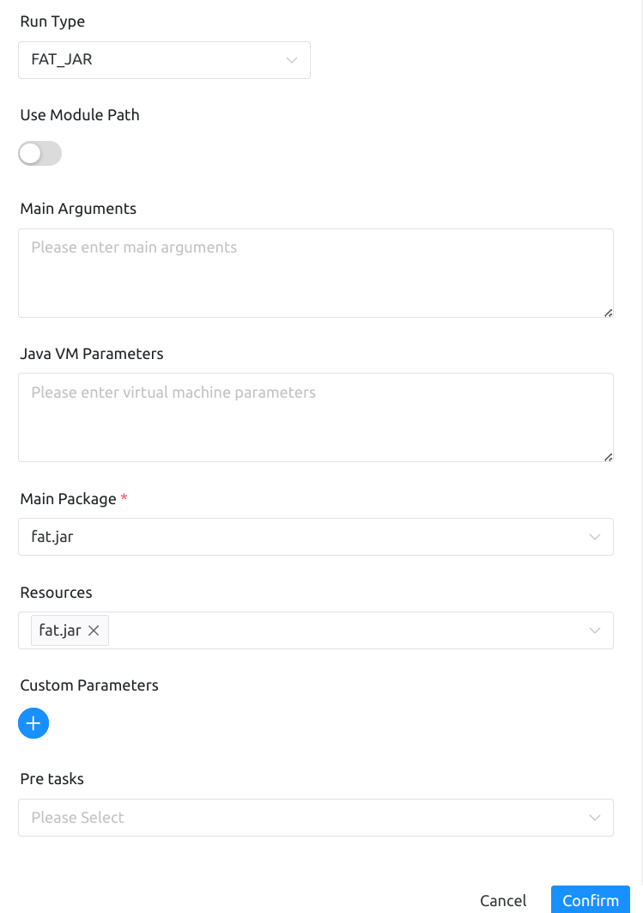

# JAVA 节点

## 综述

该节点用于执行 java 类型的任务，支持使用fat类型和normal类型的jar包作为程序入口。

## 创建任务

- 点击项目管理 -> 项目名称 -> 工作流定义，点击”创建工作流”按钮，进入 DAG 编辑页面：

- 拖动工具栏的JAVA任务节点到画板中。

## 任务参数

[//]: # (TODO: use the commented anchor below once our website template supports this syntax)
[//]: # (- 默认参数说明请参考[DolphinScheduler任务参数附录]&#40;appendix.md#默认任务参数&#41;`默认任务参数`一栏。)

- 默认参数说明请参考[DolphinScheduler任务参数附录](appendix.md)`默认任务参数`一栏。

| **任务参数** |                            **描述**                             |
|----------|---------------------------------------------------------------|
| 模块路径     | 开启使用JAVA9+的模块化特性，把所有资源放入--module-path中，要求您的worker中的JDK版本支持模块化 |
| 主程序参数    | 作为普通Java程序main方法入口参数                                          |
| 虚拟机参数    | 配置启动虚拟机参数                                                     |
| 主程序包     | 选择要运行程序的主程序包                                                  |
| 资源       | 可以是外部JAR包也可以是其他资源文件，它们都会被加入到类路径或模块路径中，您可以在自己的JAVA脚本中轻松获取      |

## 任务样例

java任务类型有两种运行模式，这里进行分别进行演示。

主要配置参数如下：

- 运行类型
- 模块路径
- 主程序参数
- 虚拟机参数
- 主程序包
- 资源文件

如图所示

- FAT_JAR类型

因为fat类型的jar，依赖和代码都在同一个jar中，则只需选择这一个jar即可

- NORMAL_JAR类型

normal1.jar是程序运行的入口，normal2.jar是所需的依赖，需要用主程序包指定程序的入口，并且在资源文件中选择所有依赖和程序入口jar文件，才能正确运行

## 注意事项

使用这两种运行类型，都必须选择主程序包和对应的资源文件，否则任务会直接失败。因为主程序包是选择程序从哪里开始运行，资源文件选择文件之后，运行程序时，资源文件才能被加入其中

基于安全原因，执行JAVA任务时，请使用环境管理功能配置JDK环境，例如`JAVA_HOME`等环境变量
